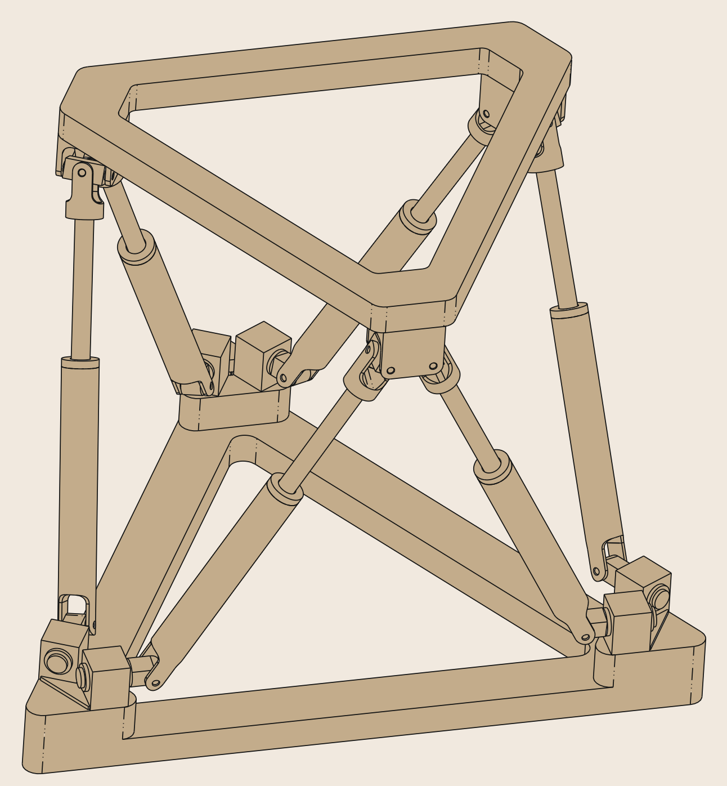

# StewartPlatformSim

ROS 2 Python simulation of a six-DoF Stewart platform (or Stewart-Gough platform<sup>[1](#hb),[2](#hb)</sup>), which is a parallel manipulator comprising a fixed base platform, a moving end-effector platform, and six serial SPS sturctures<sup>[2](#hb)</sup>.

<p align="center">
  
</p>

The inverse kinematics (IK) and differential kinematics (DK) problems are solved as to obtain the required  ***leg lengths*** and ***leg velocities*** for driving the robot to achieve a desired motion in $SE(3)$.

The map for IK, $f_{\mathrm{ik}}:\ SE(3) \to \mathbb{R}^6$ is provided, where 
- $\boldsymbol{s} = f_{\mathrm{ik}}(^b\boldsymbol{\xi}_e)$
- $\boldsymbol{s} \in \mathbb{R}^6$ is the leg length
- $^b\boldsymbol{\xi}_e \in SE(3)$ is the end-effector pose w.r.t. base.

The *inverse* Jacobian for DK, $J_b^{-1}:\ se(3) \to \mathbb{R}^6$ is also provided, where
- $\dot{\boldsymbol{s}} = J_b^{-1} \cdot \mathcal{V}_b = J_b^{-1} \cdot \mathrm{Ad}(^b\boldsymbol{\xi}_e) \cdot \mathcal{V}_e$
- $\dot{\boldsymbol{s}} \in \mathbb{R}^6$ is the leg velocity
- $J_b^{-1} \in \mathbb{R}^{6\times 6}$ and $\mathcal{V}_b \in se(3)$ are the *base* inverse Jacobian and *base* twist, respectively
- $\mathcal{V}_e \in se(3)$ is the *end-effector* twist (spatial velocity for both linear and angular) that can be transformed into $\mathcal{V}_b$ through the adjoint map $\mathrm{Ad}(^b\boldsymbol{\xi}_e) \in \mathbb{R}^{6\times 6}$.

## Simulation (visualised in ROS 2 RViz2)
<p align="center">
    
</p>

## Demo
Run the simulation in ros2:
```bash
# Simulate in ros2 and visualise in rivz2
cd ~/stewart_platform_sim && python3 sim_ros2.py
rviz2
```

## Bibliography
- Picture of the Stewart-Gough platform mechanism:
  - <a name="hb">[1]</a> J.-P. Merlet, C. Gosselin, and Tian Huang. Parallel mechanisms. In B. Siciliano and O. Khatib, editors, Handbook of Robotics, Second Edition, pages 443–461. Springer-Verlag, 2016.

- Stewart platform IK and DK:
  - <a name="mr">[2]</a> K. M. Lynch and F. C. Park, Modern Robotics: Mechanics, Planning, and Control. Cambridge University Press, 2017.


## Contact

- **Author**: Wei-Hsuan Cheng [(johnathancheng0125@gmail.com)](mailto:johnathancheng0125@gmail.com)
- **Homepage**: [wei-hsuan-cheng](https://wei-hsuan-cheng.github.io)
- **GitHub**: [wei-hsuan-cheng](https://github.com/wei-hsuan-cheng)